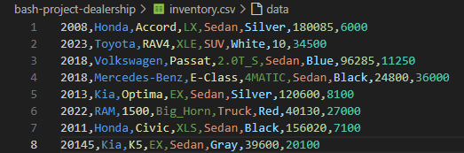

# EZ Dealership
EZ Dealership is a csv querier for a car dealership inventory system with three major functions. EZ Dealership can be used to identify errors in a csv inventory system, search inventory by any field, and sort by sortable fields.

* Easily identify errors in the inventory
* Quickly search based on any field
* View the entire inventory by sortable fields

## When to use
EZ Dealership has been set up to query a single csv file that follows the column format:
Year,Make,Model,Trim,Style,Color,Mileage,Price

For example one of the provided csv files is shown below:

However, do note that the EZ Dealership can be modified to add, remove, or reorder columns.

## How to use
To query your csv file run script.sh with the options that fit your use case.

* To identify errors in your csv run script.sh -c \[your_file.csv\] -t verify
    - If an error is identified it will be output
    - If no errors or identified it will output "No errors found"
* To search based on any field run script.sh -c \[your_file.csv\] -t search -f \[field\] -p \[parameter\]
    - The output will include all fields of all vehicles that match the search parameter
* To sort based on the year, mileage, or price fields run script.sh \[your_file.csv\] -t sort -f \[field\]{year,mileage,price}
    - The output will include every vehicle in the system sorted by that field

# Contribute
No contributions opportunities are available

# License
No formal license, this is for a school project so don't copy it.